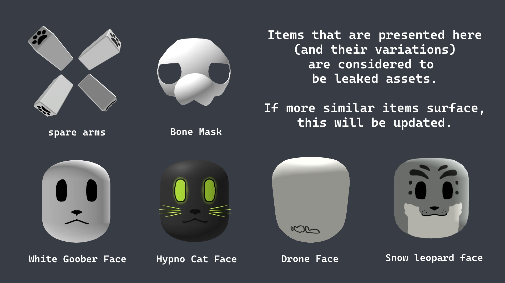
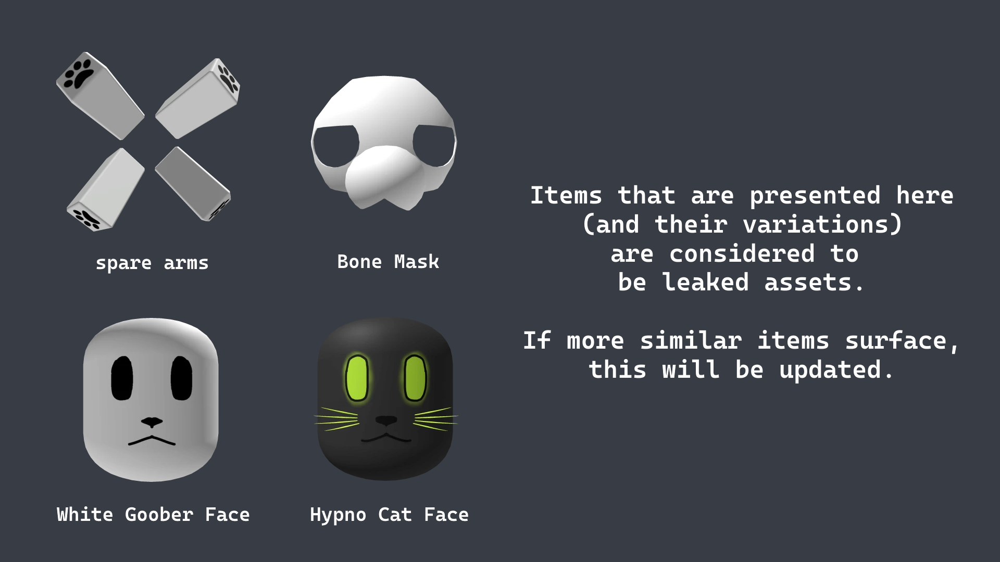
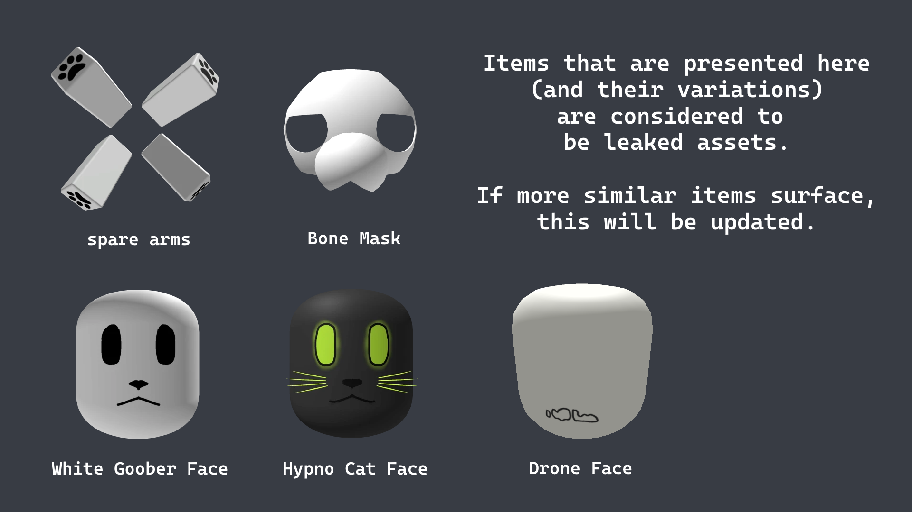

# Rule C3 | Avatar and Clothing

Certain accessory items are prohibited from wear by inmates and corporation personnel to prevent inhibition of combatant judgement and maintain decency in the facility. These include:

- Full-body packages that disrupt shirts
- Large accessories that cover the body
- Shirts or pants that look like another department's clothing
- Outfits that imitate any hostile group
- Suggestive items such as Collars, or Bypassed UGC

Personnel and Inmates wearing such cosmetics should be detained and asked to unequip the offending items. If the personnel refuses to remove the offending item they may be infracted. If an inmate refuses they are considered KOS until they remove the offending item(s).

Personnel are to not wear disguises even if the disguise is of their team.

---

## Leaked Assets

Combatants may freely terminate anyone wearing leaked Thunder Scientific Corporation assets and _actively attempting to appear as infected_ through means of add-on accessories, even if the avatar (whether intentional or not) is not entirely identical to that of an infected, regardless of whether they are test subjects or personnel.

**This applies strictly to leaked infected assets.** Any other accessory does not justify termination. In cases where someone is wrongfully terminated, the terminating individual will face consequences.

**Note:** Wearing any of the leaked assets listed below on the Test Subject team makes you liable for in-game moderation action as well.
[https://trello.com/c/iZ3FcFjE/48-player-accessories](https://trello.com/c/iZ3FcFjE/48-player-accessories "smartCard-inline")

