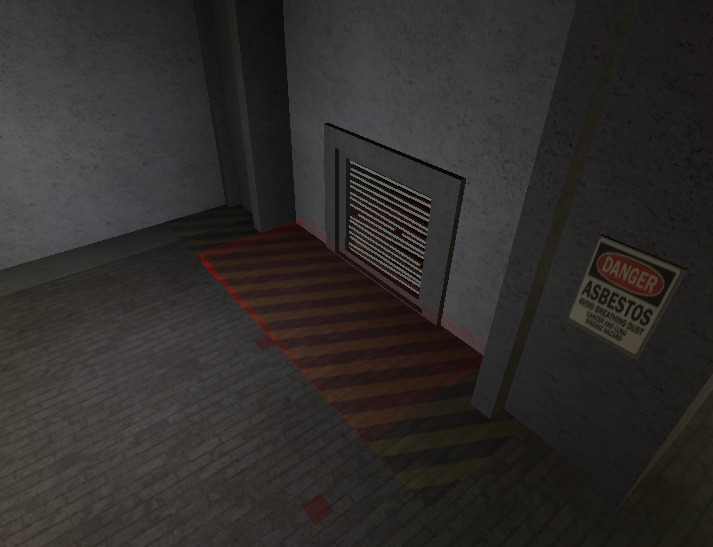
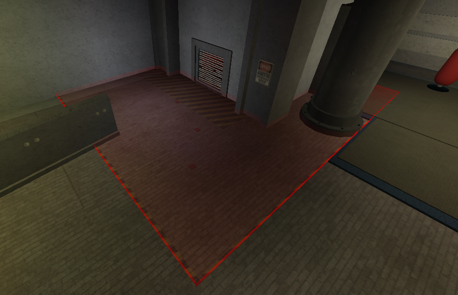
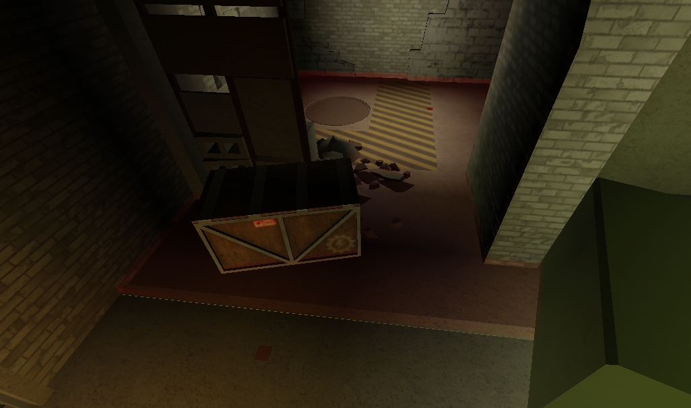
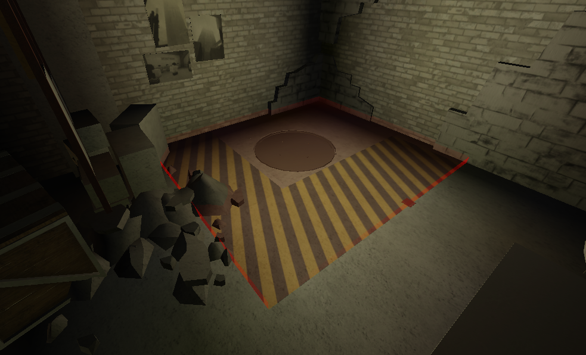

# Rule D1 | Test Subject Procedures

Inmates held in Corporation sites are to follow a strict behavioral code. Failure to do so may result in a termination of the Subject.

‌

- Security Department Personnel may follow their termination guidelines in their own handbook, even if they are not found here in the Code of Ethics. The handbook may be found here: [https://trello.com/b/t7X77BIf/tsc-security-department-handbook](https://trello.com/b/t7X77BIf/tsc-security-department-handbook "smartCard-inline")

Inmates must be terminated under the following conditions:

- An inmate is outside their containment zone without a valid escort or a proper tag for a site event.
  - Combatants reserve the right to not terminate and instead re-capture a subject if they are found outside of their containment zone and not showing any signs of hostility. During EOP Red+ combatants must terminate all roaming subjects.
- An inmate is over their containment zone’s kill line or climbing.
  - Inmates that are pushing, throwing, or carrying others over the termination line are liable for termination.,
  - Inmates who have been pushed over the line follow a 3 second grace period to move off the line before termination, and those who were thrown or carried are to be taken back over the line.
- The inmate has contraband.
- The inmate is wearing a large accessory that inhibits a combatant’s ability to see whether or not they are carrying contraband or are wearing accessories that look like contraband or is wearing an accessory covering their entire avatar or more.
  - Inmates that wear outfits that resemble any hostile teams may be downed as a precaution by combatants if there are any doubts in the true allegiance of the subject.
  - Inmates that wear accessories that are considered leaked infected assets and that are actively attempting to mimic an infected (refer to C3 for more information on such assets).
- An inmate is hostile towards personnel or other inmates.
  - Inmates may act hostile towards each other if in the boxing ring or have signed the liability waiver.
- Inmates are using the fire extinguisher in a hostile or disruptive manner (examples: Spraying it over the line, using it to obscure combatives vision, etc.)
- Inmates are destroying equipment belonging to personnel or corporation equipment.
- The inmate is actively assisting other hostile inmates. This includes but is not limited to healing, reviving, shielding, or giving items for purposes of extended hostility.
- The inmate is outside of the cell blocks during a TSCZ lockdown.
  - TSE Surgeons can be allowed outside the cellblocks as long as they remain inside the TSCZ med-bay and do not let other subjects inside.
  - Combatant L4+ may authorize security forces to cuff and relocate test subjects to a secure location to deal with breaches within the TSCZ cellblocks.
- The inmate is outside their containment zone during a raid. (Regardless of the presence of an escort.)
- An inmate is showing signs of progressing infection (of any hazard; radiation, specimen infection, etc.) within their containment zone without the ability to decontaminate them immediately.
- The inmate is on the kill-line and refuses to move off of it after a warning shot.
- An inmate is opening a ventilation shaft or manhole or is standing within proximity (5 studs) of a ventilation shaft or manhole. This increases to 15 studs when the ventilation shaft is open. (One stud is an R6 character’s arm-width).
  - Images showing the limit of the 5 studs and 15 studs radius can be found at the bottom of this section. When an inmate crosses into this threshold, with the intention to open/enter a vent or not, they are considered KoS.
  - Note: The “impossible vent” is not an escape route and therefore does not apply to this instance.
  - Combatants reserve the right to disperse test subjects away from the proximity of an escape route as long as there are 3 or more subjects near it. If the test subjects fail to move away from a 15-stud distance of the escape route they may be terminated.
  - Inmates actively running towards an open escape route may be downed by combatants.
- An inmate is currently under any long-lasting visual or statistic-altering effects outside of testing. (examples: extra health, height changes, mutations, etc.)
  - Height changes from eating sandwiches do NOT count towards this.
- The inmate is covering another inmate that’s opening an escape route.
- The inmate is actively utilizing moving objects to obstruct escape routes.
- The inmate is actively throwing mass amounts of any item around.
- The inmate is undergoing an MD Pale Virus examination, and the MD personnel in charge has concluded the event and have requested their termination.
- An inmate is located outside the cell blocks during a system riot.
- Inmates who are due for SC may be **stunned** in order to grab them more easily.
- An inmate is lighting grease on fire to purposefully block off areas or obstruct combatives.
- Inmates that are within 10 studs of downed personnel may be stunned, they may instead be downed if they’re within 10 studs and have a melee weapon out.

Note: You must confirm that an inmate has performed any of the actions listed above before termination. Termination based on assumption is prohibited. This does not apply to the 294 effects sub-point.

---

### Building

Inmates who possess the ability to use the building system have additional conditions for termination:

- Fortification of Places of Interest or using props to aid inmates in terminable offense(s) or escape from termination.
  - Blocking off entrances and passages (Doors, Hallways, Ladders, Vents, etc.)
  - Creating builds meant to give advantage to inmates in fighting or fleeing combatants
- Moving or tinkering with props that combatant engineers have placed to make a cover.
- Moving or tinkering with props while combatants are trying to destroy/move them.
- Creating structures that may allow for inmates to gain access to restricted areas.
- Creating structures that intentionally obstruct combative sightlines to the vents, kill line, or from any other area needed to be actively monitored.

TSCZ is an area where Unauthorized Engineers (UE) may freely create structures given they are not violating what is said above, or their own building regulations. Any builds that do not grant access to unauthorized areas or do not violate the termination conditions listed should not be destroyed normally. (See **Note** below)

**Note:** SET staff may destroy buildings built or compromised by test subjects during Code Red+ or during their "Base Destroyer" event.

---

### Contraband

Access cards, black market dead drop packages, items that can assist in opening ventilation or doors, and weaponry count as contraband. Items used for medical and recreational purposes are not with the exception of research vials and MD’s tools.

- Items that allow test subjects to enter an authorized location such as the Kitchen-Clearance or TSE Surgeon tool are also not considered contraband.
- Decoy Rifles, found in Aleks's Sandwich Stand in the SD armory, may only be bought by members of combatant departments. Additionally, they may only be used in logical situations, thus throwing them around with no intent of combat use is prohibited. Giving them freely to TS or members of non-combative departments is also prohibited. They are to be treated as contraband for TS.
- The “War Banner” tool is not to be considered contraband as it is purely cosmetic and has lower damage then fists.

---

### Bounties

Inmates attempting to obtain contraband from a deceased inmate by moving to stand on or right beside them may be terminated at the discretion of the security personnel.

Inmates with a valid KoS (Kill on Sight) order against them may be terminated anywhere at any time until the order expires. There must be special consideration to not kill them until they leave spawn to prevent spawn killing. Inmates also automatically gain a valid KoS order if they have over a $1,200 bounty and may be killed anywhere for the duration of the bounty.

- ISB agents engaging in bounty hunting may terminate any subject with any amount of accumulated bounty posted.

---

### Stacking

Test Subjects/Contained Infected Subjects are not to be killed or harmed for stacking unless they are caught doing it to escape or get somewhere they are not supposed to be (catwalks, balcony, any TSCZ overlooks, CISCZ balcony, any of the player-count monitors).

- An exception is made for the damaged watchtower with a garbage incinerator near the gym in the TSCZ.

_TS/CIS may be shot/hit as a warning if they are attempting to stack to any of the mentioned places._

Due to the layout of the CISCZ making it easy to escape by stacking, CIS will have less leniency and should be warned to stop stacking if they are doing it near the balcony and killed if they continue to do so.

---

### Surgeon Med-bay Exemption

TSE Surgeons are the only test subjects permitted to enter the med-bay inside TSCZ outside of medical checkups, as well as being able to obtain and carry MD tools without being considered contraband.

- Medical personnel may force out TSE Surgeons with the help of Security Forces if it is needed for an event or they are being disruptive. Surgeons may still enter to get MD tools as long as they immediately leave during this time.
- TS who are disruptively blocking the medical post door or windows may be downed and removed from the area at the discretion of the present Security Forces guarding the post or requested by the MD staffing the med-bay. Repeated attempts are cause for termination.
- TS who are attempting to get inside the med-bay or airlock without authorization may be terminated.

Medical Department members may tag up to 2 TSE Surgeons to sit behind the non-combative line and heal Personnel. They should not be terminated if they are tagged.

Test subjects may freely enter the Banquet hall and Pool room respectively.

