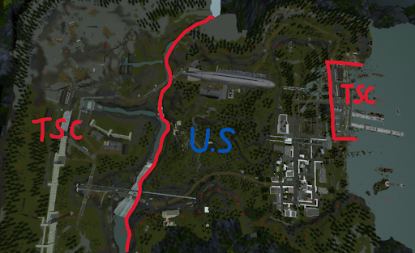
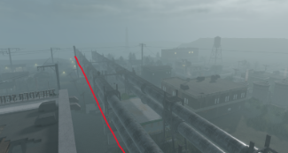
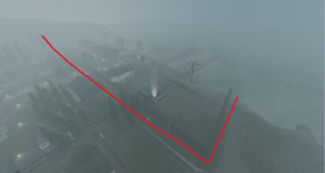

# Rule B1 | Clearance levels & Checkpoints

Personnel may not enter areas their security clearance does not permit them for, unless escorted by an authorized individual with valid reasoning. Some areas, which are usually marked, may have more specific requirements for when personnel are permitted to enter them. These areas are the following:

### Unit 4

Unit 4 of the CTZ is a checkpoint that personnel whitelisted by JU may only enter inside with valid reasoning. Anyone who is within the U4 checkpoint or containment without proper authorization may be terminated or cuffed out at the discretion of JU operatives.

The following personnel may enter the Unit 4 checkpoint:

- ISB
- AD Administrative Intern+
- SD Department Secretary+
- SO
- JU Captain+ on any allied team.
- EC Board Member+ only when spectating a U4 test.

These personnel may freely roam the checkpoint. Any personnel who disrupt the operation of the checkpoint may be forced out of the checkpoint at the discretion of the personnel operating the checkpoint. JU operatives may order these personnel away from the area if they want to.

The following personnel are whitelisted to enter Unit 4 but need valid reasoning to enter the checkpoint:

- RECON Junior Operative+ when conducting duties.
- RSD Specialists Beginner Specialist+ when hosting or spectating Unit 4 tests.
- Level-5+ Personnel that are not on the Facility Personnel team.
- SET (Specialist Architect+) May guard the U4 checkpoint following their internal regulations
- RAH MR+ may guard the U4 checkpoint whilst paired, following their internal regulations

In addition to the list above, the Juggernaut Unit have a public spread-sheet to keep track individual whitelists/blacklists along with specifics regarding groups' permissions within Unit 4.
[https://docs.google.com/spreadsheets/d/1PaayMCiBx73YBqZtWiffUvHeDtlzoaBryQGR_utiU_w/edit?gid=0#gid=0](https://docs.google.com/spreadsheets/d/1PaayMCiBx73YBqZtWiffUvHeDtlzoaBryQGR_utiU_w/edit?gid=0#gid=0 "smartCard-inline")
If a user is listed under the “Blacklisted” roster, they are not to enter U4 or else they can be met with a B1 infraction for violating their blacklist.

Group of Interests are blacklisted from entering Unit 4 entirely and may only enter with the authorization of a JU Lieutenant.

RAH assets are blacklisted from entry by default, and may only enter briefly for sweeping if they have a Handler that they are paired with. They may not enter regardless if there is a suspected or confirmed breach of Specimen 239. Handlers may enter under the same regulation as standard RECON.

Special Operations may go on the U4 checkpoint to deal with hostiles if there are no other specialized forces responding.

JU Operatives may authorize combatant personnel into Unit 4 following their internal regulations. Special Operations Corporal+ may also authorize combatives into Unit 4 for valid reasons, however JU may override this anytime.

‌

### Central Facility Mainframe (CFM)

The CFM is heavily restricted, and guarded by Special Operation or Juggernaut Unit members. Any personnel found within the CFM, that has not had authorization, is allowed to be killed on-sight.

Whitelisted personnel:

- ISB
- AD Administrative Intern+
- SD Department Secretary+
- SO
- JU Captain+ on any allied team.
- Recontainment unit may freely access CFM up to the checkpoint (second garage door)
- SET (Specialist Architect+) may also access CFM up to the checkpoint in order to grab building props for fortifying the U4 checkpoint, they may not loiter

If the tamper protection has sent out an alert, or the CFM flag has been captured, only whitelisted and the following combatives may respond;

- Recontainment Unit
- Security Department SHR+

Juggernaut Unit’s Operator+ may authorize any other combatives into the CFM if there has been a triggered heist or a flag has been capped. In the event of a radiation breach within the CFM, TTS (Fumigator+) are permitted to enter up to outer CFM (includes bridge).
Additionally, SD SHR+ may authorize other combatives into CFM if JU or SO do not respond within **10 minutes** to heists or flag captures.

If there has **not** been a trigger and hostiles are present, only whitelisted combatives are allowed to handle it. During that time, members of Special Operations and Juggernaut Unit are allowed to authorize other combatives into the CFM to assist.

Groups of Interest may not enter the CFM unless authorized by JU or they are a part of the list of whitelisted combatives and the requirement for entry is met.

While there are no hostiles, JU have the highest authority within the CFM. If no JU are present, SO will take precedence. (and if neither, ISB)
Even during times of no hostile activity, the CFM should **not** be opened randomly; only if there is a suspected hostile inside.

‌

### Warhead Silo

The checkpoint at the Warhead Silo is a heavily restricted area controlled by Special Operations members. Any personnel that are not authorized to enter the area are to be killed on-sight.

The following personnel are whitelisted and may freely enter:

- SO
- SO Field Chief+ on any allied team
- ISB
- AD Administrative Intern+
- JU Operative+

The following personnel may enter during specific events that occur inside the Silo:

- RECON/RAH during specimen breaches
- TTS during rad breaches
- All combatives during code delta

If hostiles are present during all codes except delta, after 5 minutes of no JU/SO response (5 minutes after being pinged/notified) All combatives may enter to clear out hostiles, they are to leave afterwards.

Additionally, when performing Code Ambers, all AD personnel can enter the silo with Special Operations escort.

### Surface

The surface, an irradiated yet restricted area patrolled, guarded, and overseen by Special Operations members.
Personnel of L3+ may only go outside the facility with valid reasoning, unless you are one of the following:

- TTS running a “Rad Run” or dealing with radiation on the surface
- TTS dealing with CIS or specimen breaches
- All HWY-P & Rangers
- RECON/RAH dealing with CIS or specimen breaches
- RSD personnel during tests
- VP personnel during a CIS rehabilitation event
- PB personnel during therapy related events
- Any combative during the escorting of an event
- All personnel when there is an active Code Delta or Code Amber drill
- AD Administrative Intern+
- Any Intelligence Personnel

External Relations members are allowed to bring non-TSC staff into the site under supervision.

When opening the surface gate you must say so on the radio, accompanied by an \@‌Combatives ping. Always close the gate when you are finished to avoid any escapees.
When the gate is opened, remember to grab your keycard back; failure to do so will result in punishment.

SO has the highest authority within the TSC side of the surface and can order anyone back into the facility and or kill trespassers within the designated TSC areas. Failure to comply with them allows for you to be killed on-sight.

Additionally, SO may not terminate personnel who are doing their duties whilst on the surface. SO HR+ may override usage of the surface gate in the event of an emergency when ultimately necessary.

If you are unaware of where the TSC side of the surface is; see the image listed at the bottom.

---

### No CoE Zone / Slums

The slums, also notoriously known as the "No CoE Zone", are located within Sector 1 of the facility. The Sub-level 6 Hall B staircase located between the No CoE Zone and the Sector 1 Panic Shelter is not to be considered part of the No CoE Zone.

All rules of the Code of Ethics except A1, A2, F1, and B4 regarding radios and F2 are voided within the zone. Handbook regulations and contract regulations still apply in this zone unless said otherwise by the respective division, department, or GoI. All hostile groups that are authorized to be in Maxiburger during non-raid times may also enter this area and participate in it.

The area covers:

- “ gooberbean’s wafflehouse “
- Sewers
- Slums behind Maxiburger
- Maxiburger
  - While in the area of Maxiburger, you are not to disrupt duties of other departments, including Maxi itself (i.e. messing with their equipment, pulling lockdown and light switches, etc.), on purpose (if severe enough, may lead to an F2 infraction alongside a global blacklist)
  - You must treat others with respect and not engage in combat with Maxi staff without valid reasoning (i.e. Maxi staff violating their own handbook, abusing their power / attacking you without a proper reason)
  - You are not to mass-murder people within the area (i.e. any act which results in large amount of casualties)
  - You are not to intentionally act provocatively towards anyone, rules regarding harassment still apply and will be enforced.
  - Maxiburger employees are not permitted to leave Maxiburger grounds unless participating in Maxiburger events such as Maxi-Train, Free-Range Employees, or a rally/patrol. They may also leave if H10 is active, they are delivering food, they have authorization from Manager+ or AD, or if they are a KIP with escorts.
  - Maxiburger employees are treated as FP outside of Maxiburger, requiring them to follow the CoE.

**Note:** Any side regulations, alongside hostile termination procedures on Maxiburger territory are to be discussed between Maxi and department commands.

You may find Maxiburger handbook here: [https://trello.com/b/6QuAt0F8/tsc-maxiburger-handbook-new](https://trello.com/b/6QuAt0F8/tsc-maxiburger-handbook-new "smartCard-inline")

You may not shoot personnel outside of the No CoE zone while being in the said zone and vice versa.

You may not harm intelligence personnel (EC, ISB) inside the No CoE zone.

---

Non-combatant personnel whose special clearance allows them to enter routes marked for combatant personnel may enter them at their discretion. Some areas may require non-combatant personnel to be accompanied by security forces, and the required degree of protection may vary.

Personnel may not enter any hostile spawns unless there are confirmed hostile TS in the spawn. Personnel may not use any routes which are designated to be used by raiders, these include vents, teleports, doors, etc.

If personnel have an upgraded clearance from another department, they may utilize it as long as it doesn’t overstep the authority of the team they are on.

---

List of current clearance cards:

- Kitchen (Anyone)
- Level 1
- Level 2
- Level 3
- Level 4
- Level 5
- Omni Card (AD Only)
- Security Card (Combatants only)
- Recon & Spec Ops Armory (Combatants only)
- SO Card (Combatants only)
- Medical Card
- Lab Card
- Utility Card
- Special Access Card (Intelligence and Enforcement only)
- Redacted Access Card (Intelligence and Enforcement only)
- LD Bypass Card
- Maintenance Card
- CTZ Card

