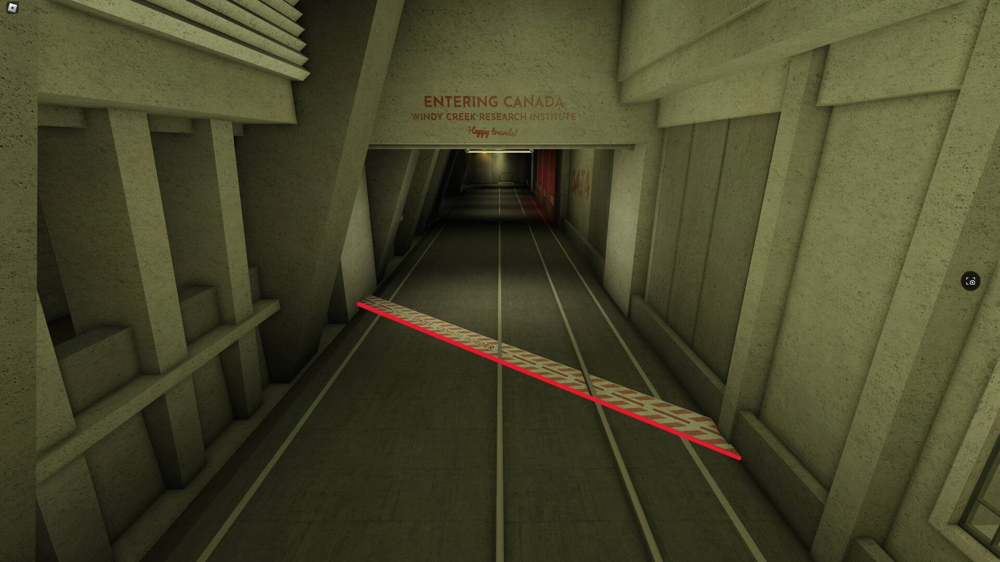

# Rule B6 | Raid Regulations

During all raids conducted by hostile forces, a set of **universal rules** will be present to keep all things fair and balanced between both parties. During any raid of any kind the following regulations apply:

- The Sector 1 LD should **not** be utilized in any way. (Blast doors, window shutters) but Sector 2 **partial** LD may be used during **loud raids**. (S2 L2 door + cargo elevator blast doors + shutters)
  - This does not apply to the TSCZ LD or CTZ LD
  - In the instance EPSILON is enabled, the S2 LD must be disabled.
  - The Black-market Lockdown may be utilized during any raid
- Any unfair advantages of any kind (Bugs, glitches, any other unintentional feature) may not be utilized during raids and can result in further punishment from the in-game moderation team.
- A 1:1 Ratio must be kept between Juggernaut Units and the hostile forces equivalent of it **with the sole exception of Centurion Raids, which has different ratio regulations.**
- Both parties must be respectful to each other and section A is always in effect for both parties, hostile or not.
- Stuns may not be utilized in any way. (Bat stun, stunstick stun, riot shield stun, etc…)
- Chem-bombing is not allowed to be utilized in any way.
- **During a breach**, BOTH PARTIES in a raid must ceasefire on each other, and deal with the breach. UN may assist in dealing with the breach if approved by TSC raid leaders. Flags must not be capped for the duration of the ceasefire.
- **Any** usage of traps on teleports and spawns is strictly prohibited during raids.

During Loud Raids, which are always announced beforehand, additional regulations apply:

- Special forces' squads may not be deployed on either side (Special Operations, Special Service Group). **This does not count for SO Tactical Response and base SSG units.**

Raids are classified into 2 different categories. “Loud Raids” and “Alternative Raids”. Loud raids are as they are, alternative raids are Flash, Stealth, and Solo raids.

- **2** Loud raids max per week (_Sunday 00:00 UTC -> Sunday 00:00 UTC_)
  - **2** day cooldown
- **7** alternative raids max per week(s)
  - **4** hour universal cooldown
- Mercenary (“Merc”) deployments have a cooldown of **1 hour**
- There is a 2 hour cooldown between UN events being hosted.

### **Regulations regarding more specifics are listed here;**

https://docs.google.com/document/d/1bkC26zcUHJjEhN6KvObE6Kq2lM8kFLRHxXa6ek3wu4g/preview?tab=t.0

It is recommended that an ER member is present during any raid, especially loud raids, to keep track of the combatant ratio.

**Security personnel may not go past the Canadian border leading to the UNSDF spawn to deal with hostiles at any time during an active raid. Doing so will result in punishment for Illegal immigration.**
An example of where the border is can be found below.

